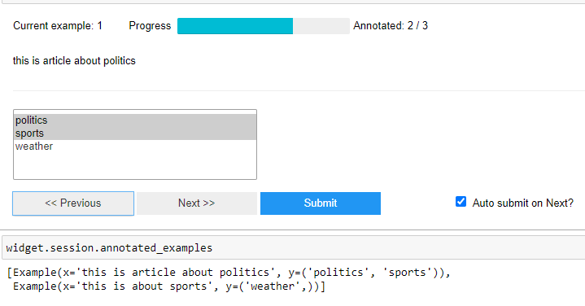
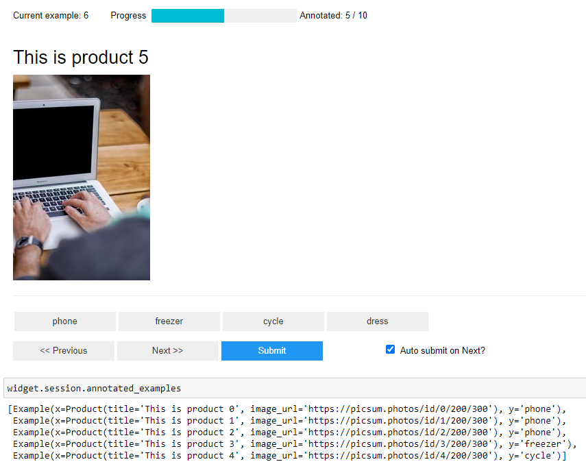

# jupino: An extensible data annotation tool that works in Jupyter notebooks

jupino is an extensible data annotation tool that leverages Jupyter notebook's display system to quickly annotate data without the hassle of setting up databases, web servers etc. that many other annotation tools need. Please note that the intention of this tool is not to replace or compete with other annotation tools but rather give people a easy and quick way to annotate data using Jupyter notebooks.

## Quckstart

```python
import jupino as jp
titles = [
    "Sg galaxy s10 Lorem Ipsum is simply dummy text of the printing and typesetting industry. Lorem Ipsum has been the industry's standard dummy text ever since the 1500s, ",
    "Wpool washing machine scrambled it to make a type specimen book. It has survived not only five centuries, but also the leap into electronic typesetting, remaining essentially unchanged. ",
    "Doll ultra red gaming laptop but also the leap into electronic typesetting, remaining essentially unchanged. "
]
labels = ["Washing machine", "Mobile phone", "Laptop", "Freezer"]
widget = jp.annotate(examples=titles, labels=labels)
display(widget)
```


You can access the annotations using
```python
widget.session.examples # all examples
widget.session.annotated_examples # all annotated examples
widget.session.unannotated_examples # all unannotated examples
```
That's it! **jupino** is flexible enough to display not only texts but also images. For extra flexibility, you can implement your own function that renders the examples on screen with ease.

## Use cases

## Binary text classification
```python
texts = [
    "this is article about politics",
    "this is not about politics"
]
labels = ["politics", "not politics"]
widget = jp.annotate(examples=texts, labels=labels)
widget
```


## Binary image classification

```python
images = [
    "https://picsum.photos/id/1/200/300",
    "https://picsum.photos/id/2/200/300",
    "https://picsum.photos/id/3/200/300",
    "https://picsum.photos/id/4/200/300", # remote urls
    "images/01picsum.jpg" # local path
]
labels = ["cat", "dog"]
widget = jp.annotate(examples=images,
                     labels=labels,
                     # tell jupino to display "x" or input as an image
                     x_widget_factory=jp.widgets.x.image(width=200, height=200)
                    )
widget
```


## Multi class classification
```
texts = [
    "this is article about politics",
    "this is about sports",
    "this is not about politics"
]
labels = ["politics", "sports", "weather"]
widget = jp.annotate(examples=texts,
                     labels=labels, 
                    # use radio button rather than buttons to display the labels
                     labels_widget_factory=jp.widgets.labels.radio_button()
                    )
widget
```


## Multi label classification
```python
texts = [
    "this is article about politics",
    "this is about sports",
    "this is not about politics"
]
labels = ["politics", "sports", "weather"]
widget = jp.annotate(examples=texts,
                     labels=labels, 
                    # use widget that supports selecting multiple items
                     labels_widget_factory=jp.widgets.labels.select_multiple()
                    )
widget
```


## Multi input data
```python
images = [
    ("./images/01picsum.jpg", "This picture describes birds and ocean"),
    ("./images/03picsum.jpg", "planets and space are shown in this image"),
]
labels = ["Caption matches", "Caption does not match"]
widget = jp.annotate(examples=images, labels=labels, 
                    # tell jupino that we have multiple inputs and they should be rendered differently
                    x_widget_factory=jp.widgets.x.multiple(
                        factories=[jp.widgets.x.image(), jp.widgets.x.html()],
                        vertical_layout=True
                    ),
                    labels_widget_factory=jp.widgets.labels.radio_button()
            )
widget
```


```python
images = [
    ("./images/01picsum.jpg", "./images/02picsum.jpg"),
    ("./images/03picsum.jpg", "./images/04picsum.jpg"),
    ("https://picsum.photos/200/300", "https://picsum.photos/200/300") # works with remote images too!
]
labels = ["Similar", "Not Similar"]
widget = jp.annotate(examples=images, labels=labels, 
            x_widget_factory=jp.widgets.x.multiple(factories=jp.widgets.x.image(), vertical_layout=False),
            labels_widget_factory=jp.widgets.labels.radio_button()
            )
widget
```


## Regression
**jupino** also supports labelling data for Regression problems. Just pass `labels=None` to `annotate` function and supply your own widget to render for "labels".
```python
import ipywidgets as w

# create our own widget to display as "labels"
def rating_widget(example: jp.Example, labels):
    return w.IntSlider(min=0, max=5, value=example.y, description="rating")

texts = [
    "this movie sucks",
    "this movie is good",
    "i found this movie to be quite interesting"
]

widget = jp.annotate(examples=texts, labels=None, labels_widget_factory=rating_widget)
widget
```


## Complex data
Write your own widget factory to render complex data
```python
import ipywidgets as w
from dataclasses import dataclass

@dataclass
class Product:
    title: str
    image_url: str
        
def product_widget(example: jp.Example):
    html = f"""
    <h2>{example.x.title}</h2>
    <div>
    
    </div>
    """
    return w.HTML(value=html)

products = [
    Product(title=f"This is product {i}", image_url=f"https://picsum.photos/id/{i}/200/300")
    for i in range(10)
]
labels = ["phone", "freezer", "cycle", "dress"]
widget = jp.annotate(examples=products, labels=labels, x_widget_factory=product_widget)
widget
```
